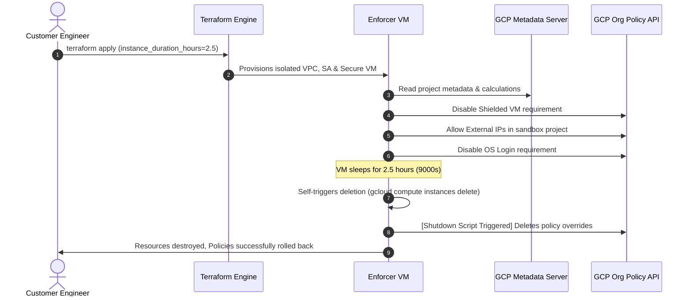

# GCP Sandbox Environment Policy Manager

[](https://www.terraform.io/)
[](https://cloud.google.com/)
[](https://www.gnu.org/software/bash/)

A robust, automated infrastructure-as-code solution designed for **Google Cloud Platform (GCP) Customer Engineers** to temporarily deploy and automatically roll back permissive project-level organization policies within sandbox and demo environments.

This project deploys an isolated, secure, and self-terminating **"Policy Enforcer" VM** that temporarily relaxes strict default organizational constraints (e.g., external IP requirements, OS Login, or Shielded VM rules) to enable rapid prototyping or demo deployments. After a configurable duration, the VM deletes itself, automatically triggering a cleanup hook that restores the sandbox to its original secure-by-default state.

---

## 🌟 Key Features

*   **⏳ Time-Bound Policy Enforcement**: Relaxed organization policies are guaranteed to be active only for a designated duration (defaults to `2.5 hours`).
*   **🔄 Automated Rollback Hook**: Leverages GCP's native Compute Engine `shutdown-script` metadata handler to completely delete temporary organization policy overrides when the VM is destroyed.
*   **🛡️ Secure by Default Architecture**:
    *   Runs within a completely isolated, custom VPC network (`argolis-policy-vpc`).
    *   No external IP address is allocated to the VM; it communicates with the Google APIs securely using **Private Google Access**.
    *   Enforces VM Shielded Config rules (`enable_secure_boot`, `enable_vtpm`, and `enable_integrity_monitoring`).
*   **🤖 Zero-Touch Self-Termination**: Once the duration expires, the VM executes a self-deletion command (`gcloud compute instances delete`), removing its infrastructure footprint without requiring manual user intervention.

---

## 🛠️ Tech Stack

*   **Infrastructure as Code**: Terraform `>= 1.0`
*   **Target Cloud Platform**: Google Cloud Platform (GCP)
*   **Control Plane Operating System**: Debian GNU/Linux 12 (Bookworm)
*   **Automation Engine**: POSIX-compliant Bash (Startup & Shutdown scripts)
*   **Target API Services**:
    *   Compute Engine API (`compute.googleapis.com`)
    *   Resource Manager / Org Policy API (`orgpolicy.googleapis.com`)
    *   Cloud Logging API (`logging.googleapis.com`)

---

## 📐 Architecture & Lifecycle

The Sandbox Environment Policy Manager coordinates a precise lifecycle. Below is the step-by-step execution flow:



### 🔒 VPC Security Design
The Enforcer VM runs inside a custom subnet (`10.0.1.0/24`) with `private_ip_google_access = true`. This is a critical design detail:
*   **No Public IPs**: The VM has no public interface, preventing ingress attacks.
*   **Secure API Access**: Private Google Access routes all traffic destined for `*.googleapis.com` through Google's private backbone network, enabling the startup and shutdown scripts to make secure `gcloud` calls to alter project policies.

---

## 📋 Prerequisites

Before deploying the policy manager, ensure you have the following set up:

1.  **Terraform CLI**: Installed locally (v1.0 or higher).
2.  **Google Cloud SDK (gcloud CLI)**: Installed and authenticated to your GCP account:
    ```bash
    gcloud auth login
    gcloud auth application-default login
    ```
3.  **IAM Permissions**:
    *   You must have **Project Editor** or **Project Owner** permissions in the target GCP project to provision networks, service accounts, and compute resources.
    *   You must have **Org Policy Administrator** (`roles/orgpolicy.policyAdmin`) or a custom folder-level policy admin role on the target sandbox project. This is necessary because you must grant this role to the VM's Service Account after creation (or allow Terraform to manage it).

---

## 🚀 Getting Started

### 1. Clone the Repository

```bash
git clone https://github.com/your-org/sandbox-environment-policy-manager.git
cd sandbox-environment-policy-manager
```

### 2. Configure Variables

Create a `terraform.tfvars` file to customize the deployment details, or specify them in your terminal:

```hcl
project_id              = "my-sandbox-demo-project"
region                  = "us-east4"
zone                    = "us-east4-a"
instance_duration_hours = 3.5   # Enforcer VM will delete itself after 3.5 hours
```

### 3. Initialize and Apply Terraform

Initialize the Terraform providers and apply the configuration:

```bash
terraform init
terraform apply
```

Review the planned resources and type `yes` to confirm. This will provision:
*   Custom VPC network and subnet.
*   Policy Enforcer Service Account (`policy-manager-sa`).
*   Target VM Instance (`argolis-policy-enforcer`).

---

## 🔑 Critical Post-Apply Setup (IAM)

> [!IMPORTANT]
> **Manually Granting Org Policy Permissions**
>
> The Policy Enforcer VM runs under the identity of the created service account:
> `policy-manager-sa@<PROJECT_ID>.iam.gserviceaccount.com`
>
> In order for the VM to make project-level modifications to the Org Policies, **you must grant this Service Account the "Org Policy Administrator" role** (`roles/orgpolicy.policyAdmin`) at the project level (or higher folder level, if applicable).
>
> You can run the following command using your authenticated `gcloud` shell:
>
> ```bash
> gcloud projects add-iam-policy-binding my-sandbox-demo-project \
>     --member="serviceAccount:policy-manager-sa@my-sandbox-demo-project.iam.gserviceaccount.com" \
>     --role="roles/orgpolicy.policyAdmin"
> ```
>
> Without this permission, the startup script will fail with permission errors when calling `gcloud org-policies set-policy`.

---

## ⚙️ Configuration Reference

The following parameters can be configured in `variables.tf` or via a custom `.tfvars` file:

| Variable Name | Type | Default | Description |
| :--- | :--- | :--- | :--- |
| `project_id` | `string` | `"gemini-ent-agent-demos"` | The target GCP Project ID where resources will be deployed. |
| `region` | `string` | `"us-east4"` | The GCP Region for network and subnetwork resources. |
| `zone` | `string` | `"us-east4-a"` | The GCP Zone where the Enforcer VM instance will reside. |
| `instance_duration_hours` | `number` | `2.5` | The duration (in hours) that policies should remain relaxed before self-termination. |

### 📐 Internal Calculations
The configuration automatically computes the exact operational seconds using local values:
```hcl
locals {
  total_seconds = floor(var.instance_duration_hours * 3600)
}
```
This integer is passed directly into the VM's startup script to maintain precise sleep timers.

---

## 🔬 Under the Hood: The Startup & Shutdown Logic

### Startup Script (`metadata_startup_script`)
Upon VM boot, the startup script performs the following sequence:
1.  Queries the internal GCP Metadata server to fetch its active project context.
2.  Waits 30 seconds to allow all internal systems and agents to initialize.
3.  Disables **Shielded VM Requirements**:
    ```yaml
    name: projects/<PROJECT_NUMBER>/policies/compute.requireShieldedVm
    spec:
      rules:
      - enforce: false
    ```
4.  Enables **External IP Allocation**:
    ```yaml
    name: projects/<PROJECT_NUMBER>/policies/compute.vmExternalIpAccess
    spec:
      rules:
      - allowAll: true
    ```
5.  Disables **Enforced OS Login**:
    ```yaml
    name: projects/<PROJECT_NUMBER>/policies/compute.requireOsLogin
    spec:
      rules:
      - enforce: false
    ```
6.  Sleeps for the configured duration (`local.total_seconds`).
7.  Executes self-termination:
    ```bash
    gcloud compute instances delete argolis-policy-enforcer --zone=<zone> --quiet
    ```

### Shutdown Script (`shutdown-script`)
When the VM is stopped or deleted (either through the self-termination trigger or manual user deletion), GCP executes the shutdown script:
1.  Determines the project ID.
2.  Explicitly deletes the project-level overrides, automatically falling back to inherited parent-level/folder-level organizational guardrails:
    ```bash
    gcloud org-policies delete compute.requireShieldedVm --project=$PROJECT_ID
    gcloud org-policies delete compute.vmExternalIpAccess --project=$PROJECT_ID
    gcloud org-policies delete compute.requireOsLogin --project=$PROJECT_ID
    ```

---

## 🔎 Operational & Verification Commands

### 1. Monitoring Script Execution
To watch the startup script run, print logs, or debug permission issues, stream the serial port output:

```bash
gcloud compute instances get-serial-port-output argolis-policy-enforcer \
    --zone=us-east4-a \
    --project=my-sandbox-demo-project
```

Look for the log statement:
`Sleeping for 9000 seconds before self-termination...`

### 2. Inspecting Current Organization Policies
To verify that the policies have been successfully relaxed, run:

```bash
gcloud org-policies describe compute.vmExternalIpAccess --project=my-sandbox-demo-project
```

To verify that the policies are clean after termination or manual teardown:

```bash
gcloud org-policies list --project=my-sandbox-demo-project
```

### 3. Manual Immediate Teardown
If your demo completes early and you want to restore baseline security policies immediately, simply delete the VM:

```bash
gcloud compute instances delete argolis-policy-enforcer --zone=us-east4-a --quiet
```
The `shutdown-script` will automatically fire, clean up all policy overrides, and terminate resources.

---

## ⚠️ Troubleshooting & FAQ

### 🔴 The policies are not changing / Permission Denied error in Serial Console
*   **Root Cause**: The custom service account `policy-manager-sa` does not have project-level `roles/orgpolicy.policyAdmin` privileges.
*   **Resolution**: Run the command detailed in [Critical Post-Apply Setup](#-critical-post-apply-setup-iam) to grant the appropriate role.

### 🔴 The VM did not delete itself after the specified duration
*   **Root Cause**: The VM service account lacks the Compute Instance Admin role, or the project zone was changed without updating the script reference.
*   **Resolution**: Ensure `roles/compute.instanceAdmin.v1` is properly mapped to the service account (which is managed automatically in `main.tf`). Check the serial output logs to see if the `gcloud compute instances delete` command returned a permission or not-found error.

### 🔴 Does this delete other infrastructure?
*   No. The VM only deletes **itself** and the specific project-level organization policies it created. The VPC network (`argolis-policy-vpc`) and custom subnet will remain until you run `terraform destroy` from your local machine.

---

## 🧹 Teardown

Once you are completely finished with your sandbox/demo environment, clean up all VPC and Service Account configurations via Terraform:

```bash
terraform destroy
```
This will completely tear down the custom VPC, subnets, IAM roles, and the service account, ensuring no residual resources or costs remain.
